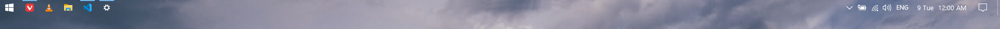
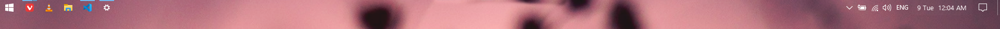
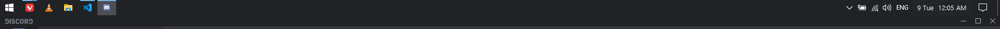
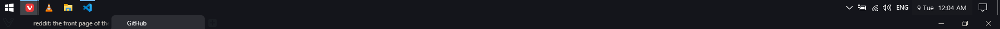
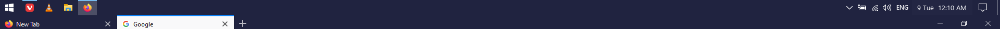

<p align="center">
    
    <br />
    
    
</p>

# XBar

A tool to change windows 10 taskbar appearance with per-app rules.

## Motivation
Although TranslucentTB is a great project, it doesn't provide per-app taskbar color so I decided to make XBar to provide per-app rules which you can configure in the config file located at `%AppData%/XBar`.

Having rules makes it possible to have seamless integration between the taskbar and the titlebar of an app if you want.

## Screenshots
Given this config :
```toml
[Regular]
Color="#00000000" # hex color with or without alpha/opacity value
AccentState="transparent" # can be one of ( normal, transparent, blue, fluent, opaque )

[Regular.Rules]


[MaximizedWindow]
Color="#1F1F1F"
AccentState="opaque"

[MaximizedWindow.Rules]
#"exeName in lowercase"="color/accentState"
"discord.exe"="#202225/opaque"
"vivaldi.exe"="#14151B/opaque"
"firefox.exe"="#202340/opaque"
```
**Desktop**


**Apps**




## TODO :

- [ ] Detect Areo Peek
- [ ] Detect Start Menu
- [ ] Detect Task View

## Contributing or Build

See the [CONTRIBUTING.md](CONTRIBUTING.md) .

## Thanks
- [TranslucentTB](https://github.com/TranslucentTB/TranslucentTB) - Great project, XBar wouldn't be possible without it.

## License
Licensed under the GPLv3 License. Please see the [LICENSE.md](LICENSE.md) file for more.